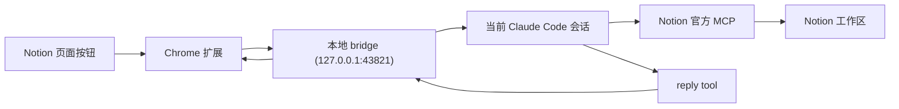

# notion2CLI

`notion2CLI` 是一个本地优先的 MVP：你在浏览器版 Notion 中点一下按钮，把“选中的内容”或“当前整页”送进 Claude Code，并让当前 Claude 会话直接回答。

它不是云服务，也不是 Notion 官方插件。当前版本采用混合架构：

- 浏览器扩展负责捕获当前页面 URL 和用户当前选区
- Notion 官方 MCP 负责读取整页正文和把结果写回文档
- 本地 bridge 负责把浏览器动作送进当前 Claude Code 会话，并把回复回传到页面面板

它由三部分组成：

- 一个可通过开发者模式加载的 Chrome 扩展
- 一个本地 `channel bridge`
- 一个 Claude Code 本地 bridge 与项目内命令

## 这个版本能做什么

- 在 `notion.so` 页面注入一个悬浮按钮
- 把选中文本直接发给 Claude
- 未选中文本时，通过 Notion MCP 读取当前整页内容再交给 Claude 处理
- 把 Claude 的最新结果通过 Notion MCP 追加写回当前 Notion 页面
- 把 Claude 的回复回传到浏览器中的结果卡片

## 系统架构



更详细说明见 [docs/ARCHITECTURE.md](/Users/morrow/coding/notion2CLI/docs/ARCHITECTURE.md)。

## 安装

### 1. 安装依赖

先进入项目目录，再安装依赖：

```bash
cd /Users/morrow/coding/notion2CLI
npm install
```

### 2. 启动 Claude Code

当前官方 `Channels` 仍处于 **research preview**。按照 Claude 官方文档，自定义 channel 在预览期内必须通过 `--dangerously-load-development-channels` 显式放行，不能完全省掉。来源：
[Channels reference](https://code.claude.com/docs/en/channels-reference)

但这个项目现在已经不再要求 `--plugin-dir`。进入项目目录后，直接启动：

```bash
cd /Users/morrow/coding/notion2CLI
claude --dangerously-load-development-channels server:notion2cli_bridge
```

这样做的原因是，这个仓库已经提供了项目级：

- `.mcp.json`
- `.claude/commands/*`

所以只要你在项目目录里运行 `claude`，命令和 bridge 配置都会自动生效。

### 3. 在 Claude Code 里装好 Notion 官方 MCP

官方文档：
[Connecting to Notion MCP](https://developers.notion.com/guides/mcp/get-started-with-mcp)

推荐命令：

```bash
claude mcp add --transport http notion https://mcp.notion.com/mcp
```

之后在 Claude Code 里用 `/mcp` 完成 OAuth。

如果你希望把这个配置共享给当前项目，也可以按照 Notion 官方文档使用 `--scope project` 写入项目级配置。无论采用哪种 scope，都需要完成一次 OAuth 才能读写页面。

如果你已经把浏览器扩展和当前 Claude 会话配对好了，也可以直接在 Notion 页面右下角结果面板里点击“安装”。扩展会把下面这句原样送进当前 Claude 会话，请 Claude 按官方文档完成配置：

```text
按照以下 notion 官方文档完成 notion MCP 的安装与授权：https://developers.notion.com/guides/mcp/get-started-with-mcp
```

### 4. 通过开发者模式加载 Chrome 扩展

1. 打开 `chrome://extensions`
2. 开启“开发者模式”
3. 点击“加载已解压的扩展程序”
4. 选择目录：`/Users/morrow/coding/notion2CLI/extension`

## 配对与使用

### 第一次连接

1. 在 Claude Code 中运行 `/notion2cli-connect`
2. Claude 会调用本地脚本并展示一个 6 位配对码
3. 点击浏览器工具栏中的 `notion2CLI`
4. 把配对码贴进去，点击“连接当前 Claude 会话”
5. 回到 Notion 页面，此时悬浮按钮会显示为“已连接”

如果扩展弹窗显示的是“已连接本地调试模式”，说明你现在连到的是 `npm run dev:standalone` 启动的模拟器，而不是当前 Claude 会话。这个状态下浏览器会收到模拟回执，但 Claude 终端不会收到真实的 channel 事件。

### 日常使用

1. 在浏览器里打开一个 Notion 页面
2. 可选：先选中一段文字
3. 点击右下角悬浮按钮
4. 如果有选区，点击“发送选中内容”；如果没有选区，点击“发送整页（MCP）”
5. Claude Code 当前会话会开始回答
6. 结果会出现在页面右下角的结果卡片里
7. 如果要把结果写回当前 Notion 页面，点击“写回 Notion”

### 读取与写回规则

- 选中文本：仍然来自浏览器当前选区，因为这是瞬时 UI 状态，不属于 Notion MCP 的持久数据模型
- 整页正文：默认通过 Notion 官方 MCP 读取，不再依赖浏览器 DOM 抓整页 `innerText`
- 写回文档：默认通过 Notion 官方 MCP 追加一个新的 Markdown section，不覆盖原文
- 结果面板：继续由本地 bridge 回传并展示，不直接写进 Notion

## 调试

### 检查脚本语法

```bash
npm run check
```

### 独立启动 bridge（不接 Claude，仅做本地调试）

这个模式会模拟 Claude 回复，方便你先调浏览器侧交互。
不要在正式联调“当前 Claude 会话收消息”时同时运行它；正式使用时应直接启动 Claude，并让 Claude 自己加载 `notion2cli_bridge`。

```bash
npm run dev:standalone
```

### 在 Claude Code 里查看 bridge 状态

```bash
notion2cli-status
```

如果这里显示 `standalone: true`，就说明 127.0.0.1:43821 上当前跑的是本地模拟器，不是注入当前 Claude 会话的 bridge。

## 目录结构

```text
notion2CLI/
  .claude/
    commands/
      notion2cli-connect.md
      notion2cli-status.md
  .mcp.json
  bin/
    notion2cli-connect
    notion2cli-status
  docs/
    ARCHITECTURE.md
  extension/
    manifest.json
    background.js
    content-script.js
    content-style.css
    popup.html
    popup.js
    popup.css
  server/
    channel-server.mjs
  skills/
    connect/
      SKILL.md
```

## 当前 MVP 的边界

- 只支持浏览器版 Notion
- 只支持单机、本地 Claude Code 会话
- 配对状态按 Claude 会话生命周期管理；重启会话后需要重新配对
- 整页读取和写回依赖当前 Claude 会话中已连接并已授权的 Notion 官方 MCP
- 选中内容仍然来自浏览器选区，不通过 MCP 获取当前高亮范围
- 写回默认采用追加 section 的安全路径，不做原地覆盖或 DOM 回填
- 依赖 Claude Code `Channels` 研究预览能力，因此启动时仍需 development channels 标志
