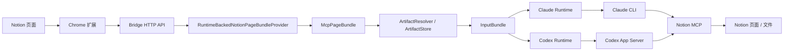

# notion2CLI 架构说明

## 当前目标

当前版本只解决一件事：

**把 Notion 页面内容先收敛成统一的 page bundle，再把 bundle 里的文本和图片工件交给 `Claude Code` / `Codex CLI`。**

当前不再保留这些旧概念：

- `Claude legacy channel`
- browser-only 图片主路径
- `pageImages` fallback
- “整页正文在 runtime 里现取、图片在浏览器旁路传”的双轨设计

## 第一性原理

模型真正能消费的是：

- 文本
- 本地图片工件

Notion MCP 真正能提供的是：

- 页面 markdown
- 页面中的文件 / 图片链接

所以中间必须有一层 bridge 来做两件事：

1. 把整页内容变成统一的 `McpPageBundle`
2. 把 bundle 里的附件链接物化成本地工件

这就是当前架构的核心。

## 总体架构

## 分层

### 1. 浏览器扩展

浏览器只负责：

- 当前页面 URL
- 当前页面标题
- 当前选区
- 任务发起和结果展示

浏览器不再负责：

- 整页正文抓取
- 页面图片发现
- 图片下载
- OCR

相关代码：

- [extension/content-script.js](/Users/morrow/coding/notion2CLI/extension/content-script.js)
- [extension/popup.js](/Users/morrow/coding/notion2CLI/extension/popup.js)

### 2. Bridge Core

bridge 是当前产品的主中心。

它负责：

- pairing
- job 生命周期
- HTTP API
- page bundle 预取
- artifact 下载与缓存
- runtime 输入装配

相关代码：

- [server/core/bridge-app.mjs](/Users/morrow/coding/notion2CLI/server/core/bridge-app.mjs)
- [server/core/http-server.mjs](/Users/morrow/coding/notion2CLI/server/core/http-server.mjs)
- [server/core/job-store.mjs](/Users/morrow/coding/notion2CLI/server/core/job-store.mjs)
- [server/core/schemas.mjs](/Users/morrow/coding/notion2CLI/server/core/schemas.mjs)
- [server/core/mcp-page-bundle.mjs](/Users/morrow/coding/notion2CLI/server/core/mcp-page-bundle.mjs)
- [server/core/page-bundle-provider.mjs](/Users/morrow/coding/notion2CLI/server/core/page-bundle-provider.mjs)
- [server/core/artifact-resolver.mjs](/Users/morrow/coding/notion2CLI/server/core/artifact-resolver.mjs)
- [server/core/artifact-store.mjs](/Users/morrow/coding/notion2CLI/server/core/artifact-store.mjs)
- [server/core/input-bundle.mjs](/Users/morrow/coding/notion2CLI/server/core/input-bundle.mjs)

### 3. Runtime

runtime 只负责消费 bridge 已经准备好的输入。

它不再负责：

- 自己重新拉整页正文
- 自己决定整页图片来源

#### Claude

- [server/runtimes/claude-runtime.mjs](/Users/morrow/coding/notion2CLI/server/runtimes/claude-runtime.mjs)
- [server/runtimes/claude-cli-session.mjs](/Users/morrow/coding/notion2CLI/server/runtimes/claude-cli-session.mjs)

#### Codex

- [server/runtimes/codex-runtime.mjs](/Users/morrow/coding/notion2CLI/server/runtimes/codex-runtime.mjs)
- [server/runtimes/codex-app-server-session.mjs](/Users/morrow/coding/notion2CLI/server/runtimes/codex-app-server-session.mjs)

## 核心对象

### 1. McpPageBundle

bridge 对整页内容的统一表达。

当前主要包含：

- `pageUrl`
- `pageTitle`
- `markdown`
- `warnings`
- `assets`
- `stats`
- `provider`
- `runtimeId`

相关代码：

- [server/core/mcp-page-bundle.mjs](/Users/morrow/coding/notion2CLI/server/core/mcp-page-bundle.mjs)

### 2. Artifact

从 bundle 的附件链接落地出来的本地工件。

当前最重要的是图片工件，字段包括：

- `sourceUrl`
- `cachePath`
- `mimeType`
- `sizeBytes`
- `sha256`
- `width`
- `height`

相关代码：

- [server/core/artifact-store.mjs](/Users/morrow/coding/notion2CLI/server/core/artifact-store.mjs)

### 3. InputBundle

最终交给 runtime 的统一输入对象。

当前包含：

- `pageContext`
- `request`
- `pageBundle`
- `images`
- `warnings`
- `artifactSource`
- `cacheDir`

相关代码：

- [server/core/input-bundle.mjs](/Users/morrow/coding/notion2CLI/server/core/input-bundle.mjs)

## Full-page 主路径

当前 `forward_full_page_via_mcp` 的真实流程是：

1. 浏览器发出 full-page 请求
2. bridge 调 `RuntimeBackedNotionPageBundleProvider`
3. provider 借当前 runtime 的 Notion MCP 读取整页 markdown
4. bridge 把返回结果规范化为 `McpPageBundle`
5. `ArtifactResolver` 从 bundle 中提取图片候选
6. `ArtifactStore` 下载并缓存本地图片工件
7. `InputBundle` 把 page bundle 和图片工件统一交给 runtime
8. runtime 只消费这份输入并返回结果

这里最关键的约束是：

**如果 page bundle 准备失败，整页请求直接失败。**

当前不会再：

- 让 runtime 自己重新读取整页
- 让浏览器图片旁路补洞

## 日志边界

为了后续排错，当前主路径在 bridge 侧有 3 个关键日志点：

1. `job created`
2. `page bundle prepared`
3. `input bundle prepared`

其中 `input bundle prepared` 会输出：

- `artifactSource`
- `imageCount`
- `warnings`
- 每张图片的 `sourceUrl / mimeType / cachePath / width / height`

这让你可以快速分辨问题是在：

- page bundle 预取
- 附件解析
- 工件下载
- runtime 消费

## 为什么当前不保留兼容层

因为当前产品没有真实用户，继续保留旧路径只会引入两种问题：

1. 代码边界继续模糊  
   例如“正文到底来自 runtime 还是 bridge”“图片到底来自 bundle 还是浏览器”

2. 排错成本继续升高  
   一旦结果错误，你需要先判断系统到底走了哪条路径

所以当前版本的策略是：

**直接清掉旧兼容层，只保留一条真实主路径。**

## 当前边界

当前仍然有这些明确边界：

- runtime 依然是 `runtime-backed` 的 page bundle provider  
  也就是 bridge 还没有自己直连通用 MCP client
- 图片主路径当前只处理 `McpPageBundle` 中解析出来的图片工件
- dedicated daemon 仍然是唯一正式运行模式
- “会话附着”还没有进入当前主路径

这套结构的价值在于：

后续如果要做真正的 attach 模式，变化应只发生在 transport 层，而不是重新拆 page bundle 或 artifact pipeline。
