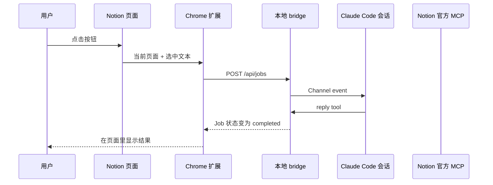

# notion2CLI 架构说明

## 用非程序员能懂的话解释

这套系统里有四个角色：

- **Notion 按钮**：你真正点击的地方
- **Chrome 扩展**：负责把点击动作和当前页面信息收集起来
- **本地 bridge**：像一个门卫，只在你电脑本地监听
- **Claude Code 会话**：真正执行任务的地方

流程如下：

1. 你在 Notion 页面点按钮
2. 扩展把“当前页面是什么、你选中了什么”发给本地 bridge
3. bridge 把这个事件推进当前 Claude Code 会话
4. Claude 确认自己收到了这段原文
5. Claude 用 `reply tool` 把结果送回 bridge
6. 扩展轮询 bridge，把结果显示在 Notion 页面右下角

## 架构图

## 为什么这样设计

### 不直接控制终端窗口

因为“接管一个正在运行的终端”非常脆弱：

- 会和用户手动输入冲突
- 很难知道当前终端状态
- 很难把结果稳定地拿回来

所以我们不去“操作终端”，而是把 bridge 设计成当前 Claude 会话的正式事件入口。

### 不直接依赖 Notion 官方按钮

因为第一版只想验证“在 Notion 点一下就能触发 Claude”，最快的做法是浏览器扩展，而不是先做云端服务和 Notion 平台级集成。

### 为什么现在只做原文传输

因为你当前真正要验证的不是“Claude 处理得好不好”，而是：

- 能不能在 Notion 中点一下
- 能不能拿到选中或整页原文
- 能不能把它送到 Claude
- 能不能拿回一个明确回执

先把这条链路证明，再加“总结、改写、任务提炼”才合理。

### 为什么先不自动写回 Notion

自动写回牵涉到：

- 权限
- 覆盖原内容的风险
- UI 上的确认机制

第一版先把结果安全地显示给用户，再决定是否写回。

## MVP 技术边界

- 浏览器端通过开发者模式加载，不走 Chrome 商店
- bridge 只监听 `127.0.0.1`
- 配对码有效期 5 分钟
- 每个 Claude 会话都有自己的本地 bridge 状态
- 未配对时，扩展只能提示连接，不能发任务
- 预览期的 Channels 仍要求启动时显式放行 development channel
