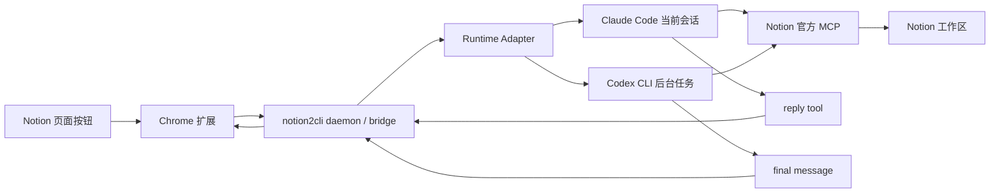

# notion2CLI 架构说明

## 当前产品形态

`notion2CLI` 现在不是“仓库脚本 + 开发者模式扩展”的松散组合，而是三层产品：

- `CLI`：全局命令 `notion2cli`
- `daemon`：本地 bridge、配对、任务分发、运行时探测
- `extension`：Notion 页面入口和结果展示

它的长期目标不是把 Claude 的实现塞给 Codex，而是把**产品核心**和**运行时接入层**拆开。

## 第一性原理

真正稳定的东西只有这条链路：

1. 浏览器拿到页面上下文和选区
2. 本地 bridge 负责配对、job、状态、回传
3. runtime 负责执行
4. Notion MCP 负责整页读取和写回

真正不稳定的是“宿主怎么接进来”：

- Claude 用 `Channels`
- Codex 用后台任务
- 未来可能还有第三种 runtime

所以我们把代码收敛成：

- `core`：产品协议和状态机
- `runtime adapters`：Claude / Codex / Standalone
- `cli + daemon`：本地产品壳层

## 总体架构



## 分层

### 1. Core

这层只管产品协议，不管底层是 Claude 还是 Codex。

职责：

- 配对码
- 浏览器 token
- job 生命周期
- HTTP API
- action schema

代码：

- [server/core/constants.mjs](/Users/morrow/coding/notion2CLI/server/core/constants.mjs)
- [server/core/schemas.mjs](/Users/morrow/coding/notion2CLI/server/core/schemas.mjs)
- [server/core/job-store.mjs](/Users/morrow/coding/notion2CLI/server/core/job-store.mjs)
- [server/core/pairing-store.mjs](/Users/morrow/coding/notion2CLI/server/core/pairing-store.mjs)
- [server/core/bridge-app.mjs](/Users/morrow/coding/notion2CLI/server/core/bridge-app.mjs)
- [server/core/http-server.mjs](/Users/morrow/coding/notion2CLI/server/core/http-server.mjs)

这层的关键好处是：浏览器扩展永远只面对一套协议。

### 2. Runtime adapters

这层只负责“怎么把 job 送进具体 runtime”。

代码：

- [server/runtimes/claude-runtime.mjs](/Users/morrow/coding/notion2CLI/server/runtimes/claude-runtime.mjs)
- [server/runtimes/codex-runtime.mjs](/Users/morrow/coding/notion2CLI/server/runtimes/codex-runtime.mjs)
- [server/runtimes/standalone-runtime.mjs](/Users/morrow/coding/notion2CLI/server/runtimes/standalone-runtime.mjs)

它们共享同一个最小 contract：

- `start()`
- `startPairing()`
- `dispatchJob()`
- `getStatus()`
- `stop()`

### 3. CLI + daemon shell

这是产品化新增的一层，负责把 repo 脚本提升成真正的全局命令。

代码：

- [bin/notion2cli.mjs](/Users/morrow/coding/notion2CLI/bin/notion2cli.mjs)
- [cli/argv.mjs](/Users/morrow/coding/notion2CLI/cli/argv.mjs)
- [cli/paths.mjs](/Users/morrow/coding/notion2CLI/cli/paths.mjs)
- [cli/http-client.mjs](/Users/morrow/coding/notion2CLI/cli/http-client.mjs)
- [cli/daemon.mjs](/Users/morrow/coding/notion2CLI/cli/daemon.mjs)
- [cli/doctor.mjs](/Users/morrow/coding/notion2CLI/cli/doctor.mjs)

职责：

- 全局命令入口
- `~/.notion2cli` 用户目录
- daemon `start/stop/status`
- `pair` / `status` / `doctor`
- Claude launch 配置生成
- Codex / Claude 的 MCP 安装命令

## 为什么 daemon 只管理 Codex / Standalone

这是产品化里最容易自欺欺人的地方，所以需要明确：

- `Codex`：可以由 notion2cli daemon 在后台调起 `codex exec`
- `Standalone`：本来就是本地模拟器
- `Claude`：依赖**当前 Claude Code 会话内**的 `Channels`

所以 `Claude` 不能被假装成同一种后台 daemon。

正确设计是：

- `notion2cli daemon start --runtime codex`
- `notion2cli daemon start --runtime standalone`
- `notion2cli claude launch`

这是刻意保留下来的不对称，目的是避免概念债。

## 用户级状态目录

产品化后，状态不再放在仓库目录里，而是放到：

```text
~/.notion2cli/
```

当前主要内容：

- `state/daemon.json`：当前 daemon 元数据
- `logs/daemon.log`：后台日志
- `logs/daemon.err.log`：后台错误日志
- `claude.mcp.json`：`notion2cli claude launch` 用的用户级 Claude MCP 配置

这一步的目的只有一个：**让用户可以在任意目录运行 CLI**。

## Claude 产品化做法

Claude 侧没有做 daemon，而是做了用户级 launch helper：

```bash
notion2cli claude launch
```

它会自动生成：

```text
~/.notion2cli/claude.mcp.json
```

并用这份配置启动：

- `notion2cli_bridge`
- `server/channel-server.mjs`

这样就不再要求用户必须在源码仓库里依赖 `.mcp.json` 或 `.claude/commands`。

## Codex 产品化做法

Codex 侧是标准 daemon 模式：

```bash
notion2cli daemon start --runtime codex
```

bridge 会在后台调起：

- `codex exec`
- `codex mcp add`
- `codex mcp login`

Codex 当前仍然是**后台任务分发**，不是“附着当前 TUI 会话”。

## 浏览器扩展现在只看什么

扩展层现在只依赖 bridge 返回的这些字段：

- `runtime`
- `capabilities`
- `notionMcp`
- `paired`
- `awaitingPairCode`

因此扩展不再理解：

- Claude channel 的协议细节
- Codex daemon 是怎么拉起来的
- MCP 安装命令具体长什么样

这就是产品化后最关键的“低耦合边界”。

## 安全和保守策略

当前保守策略保持不变：

- bridge 只监听 `127.0.0.1`
- 配对码短期有效
- 结果写回默认只做追加 section
- 整页读取和写回仍然通过 Notion 官方 MCP
- 浏览器选区仍然只从浏览器拿，不伪装成 MCP 能力

这些约束不是缺点，而是为了把损坏半径压小。

## 当前边界

- 浏览器扩展仍然通过开发者模式加载
- daemon 目前是本地后台进程，还没有做 OS 级开机自启
- 本地通信目前仍然是 `127.0.0.1` HTTP
- 更正式的产品阶段再考虑 Native Messaging 或更强 IPC
- Claude 仍依赖 research preview 的 `Channels`
- Codex 仍不复用已打开的交互 TUI
