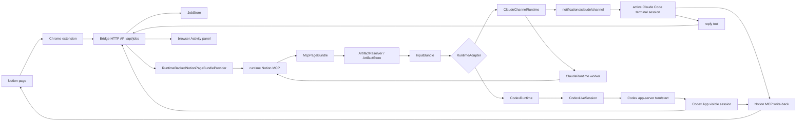

# notion2CLI Architecture

## MVP Goal

The MVP does one thing:

**Use a Notion page as the rich-text input surface for a local AI CLI session.**

When the user clicks the browser action from a Notion page, notion2CLI sends either the current text selection or the full page as the next user input to the selected local runtime. The result returns to the browser Activity panel. If the task calls for it, the runtime can write back to Notion through Notion MCP.

## Non-Goals

The current MVP intentionally does not include:

- context-only delivery into a session without starting a turn
- `/api/session/deliver` style APIs
- direct Notion API access from the bridge
- deterministic Notion writes performed by the bridge itself
- complete generic file attachment support
- Claude Desktop input injection
- Chrome Native Messaging
- full two-way history sync between the extension, bridge, Codex App, and Claude terminal

## First Principles

A Notion page can contain:

- text
- images
- files

The MVP reliably consumes:

- text
- local image artifacts

The bridge therefore exists to convert Notion page material into runtime-consumable input. It should not simulate copy/paste from the browser, and it should not require the user to return to a terminal and press Enter manually.

## System Overview

## Main Flows

### 1. Run selected text

1. The content script reads the current selection, page title, and page URL.
2. The background script calls `/api/jobs`.
3. The bridge creates a job.
4. The bridge builds an `InputBundle`.
5. The selected runtime runs the input as the next user request.
6. The extension polls `/api/jobs/:id` and displays the final reply.

Codex jobs enter a stable Codex App thread. Claude jobs enter the active Claude Code channel session started with `notion2cli claude launch`.

### 2. Run the current page

1. The content script sends the page title and page URL.
2. The bridge asks `RuntimeBackedNotionPageBundleProvider` to fetch the page through the runtime's Notion MCP tools.
3. The bridge normalizes the result into a `McpPageBundle`.
4. `ArtifactResolver` discovers image attachment links from the bundle.
5. `ArtifactStore` downloads and caches local image artifacts.
6. `InputBundle` combines page markdown, image artifacts, warnings, and request metadata.
7. The selected runtime starts the turn immediately.
8. The extension displays the latest reply.

Claude full-page prefetching uses a hidden `ClaudeRuntime` worker so the prefetch step does not pollute the Claude Code channel session the user is watching. The actual user task is still delivered to the active Claude channel session.

If page-bundle preparation fails, the full-page run fails. The bridge does not fall back to browser DOM scraping.

### 3. Write back to Notion

1. The Activity panel has a latest reply.
2. The user clicks `Write to Notion`, or the selected prompt profile instructs the runtime to update the page.
3. The extension creates a `write_reply_to_notion` job.
4. The selected runtime writes through Notion MCP using append, replace-selection, or replace-body behavior.
5. Codex approval happens through Activity. Claude authorization may happen through Activity for full-page reads and inside the Claude terminal for write-back.

Append mode is the recommended default because it is non-destructive.

## Layer Responsibilities

### Chrome extension

Responsible for:

- rendering the in-page Activity panel
- starting selection and full-page runs
- showing job status, approval requests, and latest replies
- starting manual write-back
- letting the user select the Codex or Claude startup path in the popup

Not responsible for:

- scraping the full page DOM
- discovering images from the DOM
- downloading images
- OCR

Related files:

- [extension/content-script.js](../extension/content-script.js)
- [extension/background.js](../extension/background.js)
- [extension/popup.js](../extension/popup.js)

### Bridge core

Responsible for:

- browser pairing
- HTTP API
- job lifecycle
- page-bundle prefetching
- image artifact download and caching
- runtime input assembly

Related files:

- [server/core/bridge-app.mjs](../server/core/bridge-app.mjs)
- [server/core/http-server.mjs](../server/core/http-server.mjs)
- [server/core/job-store.mjs](../server/core/job-store.mjs)
- [server/core/schemas.mjs](../server/core/schemas.mjs)
- [server/core/mcp-page-bundle.mjs](../server/core/mcp-page-bundle.mjs)
- [server/core/page-bundle-provider.mjs](../server/core/page-bundle-provider.mjs)
- [server/core/artifact-resolver.mjs](../server/core/artifact-resolver.mjs)
- [server/core/artifact-store.mjs](../server/core/artifact-store.mjs)
- [server/core/input-bundle.mjs](../server/core/input-bundle.mjs)

### Codex runtime

Responsible for:

- starting Codex app-server
- holding a resumable Codex thread
- running each browser job as a new turn
- capturing the latest assistant final answer
- supporting approval callbacks
- naming the thread `notion2CLI - <project name>`
- verifying after each turn that the same session is visible in Codex App through `thread/read` and `thread/list`

Related files:

- [server/runtimes/codex-runtime.mjs](../server/runtimes/codex-runtime.mjs)
- [server/runtimes/codex-live-session.mjs](../server/runtimes/codex-live-session.mjs)
- [server/runtimes/codex-app-server-session.mjs](../server/runtimes/codex-app-server-session.mjs)

### Claude channel runtime

Responsible for:

- loading as a Claude MCP server inside the Claude Code session started by `notion2cli claude launch`
- delivering browser jobs through `notifications/claude/channel`
- exposing a `reply` tool so Claude can return the final reply to the Activity panel
- using a hidden `ClaudeRuntime` worker for Notion MCP full-page prefetching
- generating notion2CLI-specific Claude MCP configuration files

Related files:

- [server/runtimes/claude-channel-runtime.mjs](../server/runtimes/claude-channel-runtime.mjs)
- [server/channel-server.mjs](../server/channel-server.mjs)
- [server/runtimes/claude-runtime.mjs](../server/runtimes/claude-runtime.mjs)
- [server/runtimes/claude-cli-session.mjs](../server/runtimes/claude-cli-session.mjs)

## Core Objects

### McpPageBundle

The normalized representation of a full Notion page:

- `pageUrl`
- `pageTitle`
- `markdown`
- `warnings`
- `assets`
- `stats`
- `provider`
- `runtimeId`

### Artifact

A local file created from a bundle attachment link. The MVP mainly handles images:

- `sourceUrl`
- `cachePath`
- `mimeType`
- `sizeBytes`
- `sha256`
- `width`
- `height`

### InputBundle

The final input object passed to the runtime:

- `pageContext`
- `request`
- `pageBundle`
- `images`
- `warnings`
- `artifactSource`
- `cacheDir`

## API Boundary

Main MVP API:

- `GET /api/status`
- `POST /api/pair/create`
- `POST /api/pair/confirm`
- `POST /api/jobs`
- `GET /api/jobs/:id`
- `POST /api/jobs/:id/approval`
- `POST /api/session/open`

`GET /api/status` returns runtime and session information. Codex responses include `threadId`, `threadName`, `turnCount`, and `appVisible`. Claude responses include channel session name, transport, turn count, and recent input/reply snippets. `POST /api/session/open` is Codex-only and opens Codex App on supported platforms.

Removed from the MVP:

- `POST /api/session/deliver`
- `thread/inject_items` context-only delivery

## Logging Boundary

Important log points:

1. `job created`
2. `page bundle prepared`
3. `input bundle prepared`
4. runtime queued / running / completed

When debugging, check:

- whether page-bundle preparation succeeded
- whether `imageCount` matches expectations
- whether artifact downloads emitted warnings
- whether the runtime job reached running / completed

## Current Boundaries

- Codex uses a Codex App session.
- Claude uses Claude Code Channels and does not support Claude Desktop input injection.
- Full-page reads still depend on the runtime's Notion MCP tools.
- Images come only from attachment links parsed from `McpPageBundle`.
- Write-back is still performed by the runtime through Notion MCP.
- Generic file attachments are not fully supported yet.
- The extension and bridge communicate through localhost HTTP.

These boundaries keep the MVP focused on the core question: can Notion become the input surface for a local CLI agent?
