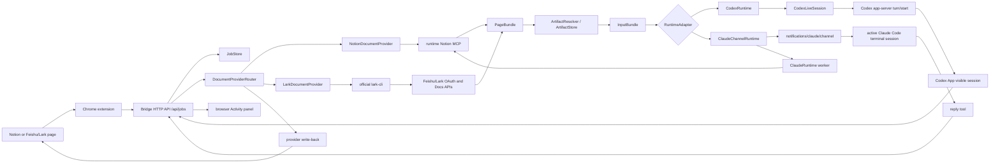

# notion2CLI Architecture

## MVP Goal

The MVP does one thing:

**Use a document page as the rich-text input surface for a local AI CLI session.**

When the user clicks the browser action from a supported Notion or Feishu/Lark page, notion2CLI sends either the current text selection or the full page as the next user input to the selected local runtime. The result returns to the browser Activity panel. If the task calls for it, the bridge writes back through the resolved document provider.

## Non-Goals

The current MVP intentionally does not include:

- context-only delivery into a session without starting a turn
- `/api/session/deliver` style APIs
- direct Notion API access from the bridge
- complete generic file attachment support
- Claude Desktop input injection
- Chrome Native Messaging
- full two-way history sync between the extension, bridge, Codex App, and Claude terminal

## First Principles

A document page can contain:

- text
- images
- files

The MVP reliably consumes:

- text
- local image artifacts

The bridge therefore exists to convert document page material into runtime-consumable input. It should not simulate copy/paste from the browser, and it should not require the user to return to a terminal and press Enter manually.

## System Overview

## Main Flows

### 1. Run selected text

1. The content script reads the current selection, page title, and page URL.
2. The background script calls `/api/jobs`.
3. The bridge creates a job.
4. The bridge builds an `InputBundle`.
5. The selected runtime runs the input as the next user request.
6. The extension polls `/api/jobs/:id` and displays the final reply.

Codex jobs enter a stable Codex App thread. Claude jobs enter the active Claude Code channel session started with `notion2cli claude launch`.

### 2. Run the current page

1. The content script sends the page title and page URL.
2. The bridge asks `DocumentProviderRouter` to resolve the page provider.
3. Notion pages are fetched through runtime Notion MCP; Feishu/Lark pages are fetched through the official `lark-cli`.
4. The bridge normalizes the result into a page bundle.
5. `ArtifactResolver` discovers image attachment links from the bundle.
6. `ArtifactStore` downloads and caches local image artifacts.
7. `InputBundle` combines page markdown, image artifacts, warnings, and request metadata.
8. The selected runtime starts the turn immediately.
9. The extension displays the latest reply.

Claude full-page prefetching uses a hidden `ClaudeRuntime` worker so the prefetch step does not pollute the Claude Code channel session the user is watching. The actual user task is still delivered to the active Claude channel session.

If page-bundle preparation fails, the full-page run fails. The bridge does not fall back to browser DOM scraping.

### 3. Write back

1. The Activity panel has a latest reply.
2. The user clicks provider write-back, or the selected prompt profile instructs the runtime to update the page.
3. The extension creates a `write_reply_to_notion` job.
4. Feishu/Lark writes are handled by the bridge through explicit `lark-cli api` calls to Wiki v2 and Docx v1 OpenAPI endpoints.
5. Notion writes fall back to the selected runtime and Notion MCP.
6. Codex approval happens through Activity. Claude authorization may happen through Activity for full-page reads and inside the Claude terminal for Notion write-back.

Append mode is the recommended default because it is non-destructive.

## Layer Responsibilities

### Chrome extension

Responsible for:

- rendering the in-page Activity panel
- starting selection and full-page runs
- showing job status, approval requests, and latest replies
- starting manual write-back
- letting the user select the Codex or Claude startup path in the popup

Not responsible for:

- scraping the full page DOM
- discovering images from the DOM
- downloading images
- OCR

Related files:

- [extension/content-script.js](../extension/content-script.js)
- [extension/background.js](../extension/background.js)
- [extension/popup.js](../extension/popup.js)

### Bridge core

Responsible for:

- browser pairing
- HTTP API
- job lifecycle
- document provider routing
- page-bundle prefetching
- image artifact download and caching
- runtime input assembly
- deterministic Feishu/Lark write-back through `lark-cli`

Related files:

- [server/core/bridge-app.mjs](../server/core/bridge-app.mjs)
- [server/core/http-server.mjs](../server/core/http-server.mjs)
- [server/core/job-store.mjs](../server/core/job-store.mjs)
- [server/core/schemas.mjs](../server/core/schemas.mjs)
- [server/core/mcp-page-bundle.mjs](../server/core/mcp-page-bundle.mjs)
- [server/core/page-bundle-provider.mjs](../server/core/page-bundle-provider.mjs)
- [server/core/artifact-resolver.mjs](../server/core/artifact-resolver.mjs)
- [server/core/artifact-store.mjs](../server/core/artifact-store.mjs)
- [server/core/input-bundle.mjs](../server/core/input-bundle.mjs)
- [server/providers/provider-router.mjs](../server/providers/provider-router.mjs)
- [server/providers/lark-provider.mjs](../server/providers/lark-provider.mjs)
- [server/providers/notion-provider.mjs](../server/providers/notion-provider.mjs)

### Codex runtime

Responsible for:

- starting Codex app-server
- holding a resumable Codex thread
- running each browser job as a new turn
- capturing the latest assistant final answer
- supporting approval callbacks
- naming the thread `notion2CLI - <project name>`
- verifying after each turn that the same session is visible in Codex App through `thread/read` and `thread/list`
- resolving Windows npm `.cmd` shims through the shared runtime process launcher when running natively on Windows

Related files:

- [server/runtimes/codex-runtime.mjs](../server/runtimes/codex-runtime.mjs)
- [server/runtimes/codex-live-session.mjs](../server/runtimes/codex-live-session.mjs)
- [server/runtimes/codex-app-server-session.mjs](../server/runtimes/codex-app-server-session.mjs)
- [server/runtimes/exec-utils.mjs](../server/runtimes/exec-utils.mjs)

### Claude channel runtime

Responsible for:

- loading as a Claude MCP server inside the Claude Code session started by `notion2cli claude launch`
- delivering browser jobs through `notifications/claude/channel`
- exposing a `reply` tool so Claude can return the final reply to the Activity panel
- using a hidden `ClaudeRuntime` worker for Notion MCP full-page prefetching
- generating notion2CLI-specific Claude MCP configuration files

Related files:

- [server/runtimes/claude-channel-runtime.mjs](../server/runtimes/claude-channel-runtime.mjs)
- [server/channel-server.mjs](../server/channel-server.mjs)
- [server/runtimes/claude-runtime.mjs](../server/runtimes/claude-runtime.mjs)
- [server/runtimes/claude-cli-session.mjs](../server/runtimes/claude-cli-session.mjs)

### Document providers

Responsible for:

- detecting whether a page URL belongs to a provider
- producing full-page bundles
- exposing provider setup status
- performing deterministic write-back when the provider supports it

Notion provider behavior:

- full-page reads use the selected runtime's Notion MCP setup
- write-back remains runtime-backed through Notion MCP

Feishu/Lark provider behavior:

- setup and user authorization are delegated to the official local `lark-cli`
- `lark-cli` process launches use the shared runtime process launcher, including Windows npm `.cmd` shim resolution
- wiki URLs are resolved with `GET /open-apis/wiki/v2/spaces/get_node`
- docx content is read with Docx v1 raw-content and block APIs
- media tokens are downloaded through `lark-cli docs +media-download`
- append and replace-body writes use Docx v1 block children create/delete APIs
- replace-selection patches one uniquely matched text block and fails if the selected text is missing, ambiguous, or spans multiple rich-text runs

Related files:

- [server/providers/provider-router.mjs](../server/providers/provider-router.mjs)
- [server/providers/lark-provider.mjs](../server/providers/lark-provider.mjs)
- [server/providers/lark/lark-auth-service.mjs](../server/providers/lark/lark-auth-service.mjs)
- [server/providers/lark/lark-cli-adapter.mjs](../server/providers/lark/lark-cli-adapter.mjs)
- [server/providers/lark/lark-document-parser.mjs](../server/providers/lark/lark-document-parser.mjs)
- [server/providers/lark/lark-media-resolver.mjs](../server/providers/lark/lark-media-resolver.mjs)
- [server/providers/notion-provider.mjs](../server/providers/notion-provider.mjs)

## Core Objects

### PageBundle

The normalized representation of a full document page:

- `pageUrl`
- `pageTitle`
- `markdown`
- `warnings`
- `assets`
- `stats`
- `provider`
- `providerId`
- `sourceProvider`
- `runtimeId`

### Artifact

A local file created from a bundle attachment link. The MVP mainly handles images:

- `sourceUrl`
- `cachePath`
- `mimeType`
- `sizeBytes`
- `sha256`
- `width`
- `height`

### InputBundle

The final input object passed to the runtime:

- `pageContext`
- `request`
- `pageBundle`
- `images`
- `warnings`
- `artifactSource`
- `cacheDir`

## API Boundary

Main MVP API:

- `GET /api/status`
- `POST /api/pair/create`
- `POST /api/pair/confirm`
- `POST /api/jobs`
- `GET /api/jobs/:id`
- `POST /api/jobs/:id/approval`
- `POST /api/session/open`

`GET /api/status` returns runtime, session, and document provider information. Codex responses include `threadId`, `threadName`, `turnCount`, and `appVisible`. Claude responses include channel session name, transport, turn count, and recent input/reply snippets. `POST /api/session/open` is Codex-only and opens Codex App on supported platforms.

Removed from the MVP:

- `POST /api/session/deliver`
- `thread/inject_items` context-only delivery

## Logging Boundary

Important log points:

1. `job created`
2. `page bundle prepared`
3. `input bundle prepared`
4. runtime queued / running / completed

When debugging, check:

- whether page-bundle preparation succeeded
- whether `imageCount` matches expectations
- whether artifact downloads emitted warnings
- whether the runtime job reached running / completed

## Current Boundaries

- Codex uses a Codex App session.
- Claude uses Claude Code Channels and does not support Claude Desktop input injection.
- Native Windows is supported as a beta path for the local bridge, document providers, and CLI runtime process model. WSL2 remains the recommended fallback when a project depends on Linux-only tooling.
- Automatic Codex App opening is implemented only for macOS. Windows users can inspect the thread from the CLI and open Codex App manually.
- Notion full-page reads still depend on the runtime's Notion MCP tools.
- Feishu/Lark support is limited to docx pages and wiki nodes whose underlying object is a docx document.
- Images come from media references discovered in Docx block payloads.
- Notion write-back is still performed by the runtime through Notion MCP.
- Feishu/Lark write-back is performed by the bridge through `lark-cli` and intentionally fails on ambiguous replace-selection operations.
- Generic file attachments are not fully supported yet.
- The extension and bridge communicate through localhost HTTP.

These boundaries keep the MVP focused on the core question: can a document workspace become the input surface for a local CLI agent?
