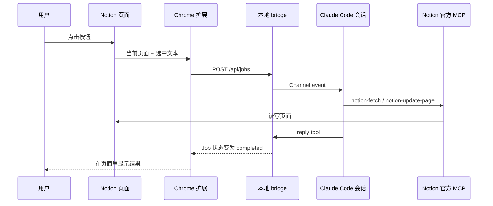

# notion2CLI 架构说明

## 用非程序员能懂的话解释

这套系统里有四个角色：

- **Notion 按钮**：你真正点击的地方
- **Chrome 扩展**：负责把点击动作和当前页面信息收集起来
- **本地 bridge**：像一个门卫，只在你电脑本地监听
- **Claude Code 会话**：真正执行任务的地方
- **Notion 官方 MCP**：负责读取整页和写回页面的权威通道

流程如下：

1. 你在 Notion 页面点按钮
2. 扩展把“当前页面 URL 是什么、你选中了什么、你是要处理还是要写回”发给本地 bridge
3. bridge 把这个事件推进当前 Claude Code 会话
4. 如果你选中了文字，Claude 直接处理选区；如果你没选区，Claude 通过 Notion 官方 MCP 读取整页
5. 如果你点击“写回 Notion”，Claude 通过 Notion 官方 MCP 把结果追加回当前页面
6. Claude 用 `reply tool` 把结果或写回确认送回 bridge
7. 扩展轮询 bridge，把结果显示在 Notion 页面右下角

## 架构图

## 为什么这样设计

### 不直接控制终端窗口

因为“接管一个正在运行的终端”非常脆弱：

- 会和用户手动输入冲突
- 很难知道当前终端状态
- 很难把结果稳定地拿回来

所以我们不去“操作终端”，而是把 bridge 设计成当前 Claude 会话的正式事件入口。

### 不直接依赖 Notion 官方按钮

因为第一版只想验证“在 Notion 点一下就能触发 Claude”，最快的做法是浏览器扩展，而不是先做云端服务和 Notion 平台级集成。

### 为什么现在只做原文传输

因为你当前真正要验证的不是“Claude 处理得好不好”，而是：

- 能不能在 Notion 中点一下
- 能不能拿到用户当前选区
- 能不能稳定读取整页权威内容
- 能不能把它送到 Claude
- 能不能拿回一个明确回执

先把这条链路证明，再加“总结、改写、任务提炼”才合理。

### 为什么选区不改成 MCP

因为选区是浏览器里的瞬时状态，不是 Notion 后端的持久对象。MCP 很适合读取页面和写回页面，但不负责“你此刻框选了哪几个字符”。

所以这里采用混合做法：

- 选区：浏览器扩展负责
- 整页读取：Notion MCP 负责
- 写回页面：Notion MCP 负责
- 临时结果展示：浏览器面板负责

### 为什么写回默认只做追加

自动写回牵涉到：

- 权限
- 覆盖原内容的风险
- 结果是否需要人工确认

因此默认策略不是“原地替换”，而是“追加一个新的 Markdown section”。这样更符合安全优先和官方 MCP/Markdown 更新接口的使用方式，也更容易审计。

## MVP 技术边界

- 浏览器端通过开发者模式加载，不走 Chrome 商店
- bridge 只监听 `127.0.0.1`
- 配对码有效期 5 分钟
- 每个 Claude 会话都有自己的本地 bridge 状态
- 未配对时，扩展只能提示连接，不能发任务
- 整页读取与写回要求当前 Claude 会话已连接并授权 Notion 官方 MCP
- 默认写回路径是追加，不做破坏性替换
- 预览期的 Channels 仍要求启动时显式放行 development channel
