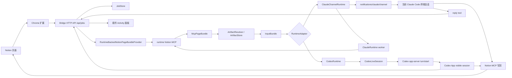

# notion2CLI 架构说明

## MVP 目标

当前 MVP 只做一件事：

**把 Notion 页面变成本地 AI CLI 会话的富文本输入框。**

用户在 Notion 页面点击插件按钮后，系统把当前选区或当前整页作为下一条用户输入交给当前 runtime，并直接开始处理。回复先回到插件 Activity 面板，再由用户决定是否写回 Notion。

## 不做的事

MVP 暂不做：

- “只附加到当前会话、等待用户稍后追问”的模式
- `/api/session/deliver` 这类 context-only 投递接口
- bridge 自己直连 Notion API / MCP 读取页面
- bridge 自己确定性写回 Notion
- 完整文件附件支持
- Claude Desktop 输入注入
- Chrome Native Messaging
- Codex App、Claude 终端、插件之间的全双向历史同步

## 第一性原理

Notion 输入框能承载：

- 文本
- 图片
- 文件

当前 MVP 稳定消费的是：

- 文本
- 本地图片工件

所以 bridge 的核心职责是把 Notion 页面整理成 runtime 能消费的输入，而不是让浏览器模拟复制粘贴，也不是让用户回终端手动按 Enter。

## 总体架构

## 主流程

### 1. 运行选中内容

1. 内容脚本读取当前选区、页面标题和页面 URL
2. background 调 `/api/jobs`
3. bridge 创建 job
4. bridge 生成 `InputBundle`
5. 当前 runtime 把输入作为新问题执行
6. 插件轮询 `/api/jobs/:id`，展示最终回复

Codex 路径会进入固定 Codex App thread。Claude 路径会进入 `notion2cli claude launch` 启动的当前 Claude Code channel 会话。

### 2. 运行当前页

1. 内容脚本发送页面标题和页面 URL
2. bridge 通过 `RuntimeBackedNotionPageBundleProvider` 借 runtime 的 Notion MCP 读取整页
3. bridge 规范化为 `McpPageBundle`
4. `ArtifactResolver` 从 bundle 中找图片附件
5. `ArtifactStore` 下载并缓存本地图片工件
6. `InputBundle` 合并页面正文、图片工件和警告信息
7. 当前 runtime 直接启动处理
8. 插件显示最新回复

Claude 的整页读取由隐藏的 `ClaudeRuntime worker` 完成，目的是避免“预取整页”这一步污染用户正在看的 Claude channel 会话。真正的用户问题仍会投递到当前 Claude channel 会话。

如果 page bundle 准备失败，整页运行直接失败，不回退到浏览器 DOM 抓取。

### 3. 写回 Notion

1. 插件面板已有最新回复
2. 用户点击“写回 Notion”
3. 插件再次创建 `write_reply_to_notion` job
4. 当前 runtime 通过 Notion MCP 执行追加、替换选区或覆盖正文
5. 需要授权时，Codex approval 走 Activity；Claude 整页读取授权走 Activity，写回授权可能出现在 Claude 终端里

MVP 默认建议只使用非破坏性的“追加到页面末尾”。

## 分层职责

### Chrome 扩展

负责：

- 显示页面内 Activity 面板
- 发起“运行选中内容 / 运行当前页”
- 展示 job 状态、approval、最新回复
- 发起手动写回
- 允许用户在弹窗里选择 Codex 或 Claude 启动流程

不负责：

- 抓整页 DOM 正文
- 从 DOM 发现图片
- 下载图片
- OCR

相关代码：

- [extension/content-script.js](/Users/morrow/coding/notion2CLI/extension/content-script.js)
- [extension/background.js](/Users/morrow/coding/notion2CLI/extension/background.js)
- [extension/popup.js](/Users/morrow/coding/notion2CLI/extension/popup.js)

### Bridge Core

负责：

- pairing
- HTTP API
- job 生命周期
- page bundle 预取
- 图片 artifact 下载与缓存
- runtime 输入装配

相关代码：

- [server/core/bridge-app.mjs](/Users/morrow/coding/notion2CLI/server/core/bridge-app.mjs)
- [server/core/http-server.mjs](/Users/morrow/coding/notion2CLI/server/core/http-server.mjs)
- [server/core/job-store.mjs](/Users/morrow/coding/notion2CLI/server/core/job-store.mjs)
- [server/core/schemas.mjs](/Users/morrow/coding/notion2CLI/server/core/schemas.mjs)
- [server/core/mcp-page-bundle.mjs](/Users/morrow/coding/notion2CLI/server/core/mcp-page-bundle.mjs)
- [server/core/page-bundle-provider.mjs](/Users/morrow/coding/notion2CLI/server/core/page-bundle-provider.mjs)
- [server/core/artifact-resolver.mjs](/Users/morrow/coding/notion2CLI/server/core/artifact-resolver.mjs)
- [server/core/artifact-store.mjs](/Users/morrow/coding/notion2CLI/server/core/artifact-store.mjs)
- [server/core/input-bundle.mjs](/Users/morrow/coding/notion2CLI/server/core/input-bundle.mjs)

### Codex Runtime

负责：

- 启动 Codex app-server
- 持有可恢复的 Codex thread
- 将每个插件请求作为新 turn 执行
- 捕获最新 assistant final answer
- 支持 approval 回调
- 为 thread 设置稳定标题 `notion2CLI - <项目名>`
- 每个 turn 完成后用 `thread/read` 和 `thread/list` 校验同一个 Codex App 可见 session

相关代码：

- [server/runtimes/codex-runtime.mjs](/Users/morrow/coding/notion2CLI/server/runtimes/codex-runtime.mjs)
- [server/runtimes/codex-live-session.mjs](/Users/morrow/coding/notion2CLI/server/runtimes/codex-live-session.mjs)
- [server/runtimes/codex-app-server-session.mjs](/Users/morrow/coding/notion2CLI/server/runtimes/codex-app-server-session.mjs)

### Claude Channel Runtime

负责：

- 作为 Claude MCP server 加载进 `notion2cli claude launch` 启动的 Claude Code 会话
- 通过 `notifications/claude/channel` 把插件 job 投递到当前 Claude 终端会话
- 提供 `reply` tool，让 Claude 把最终回复回传给插件面板
- 使用隐藏的 `ClaudeRuntime worker` 做整页 Notion MCP 预取
- 生成并使用 notion2CLI 专用的 Claude MCP 配置文件

相关代码：

- [server/runtimes/claude-channel-runtime.mjs](/Users/morrow/coding/notion2CLI/server/runtimes/claude-channel-runtime.mjs)
- [server/channel-server.mjs](/Users/morrow/coding/notion2CLI/server/channel-server.mjs)
- [server/runtimes/claude-runtime.mjs](/Users/morrow/coding/notion2CLI/server/runtimes/claude-runtime.mjs)
- [server/runtimes/claude-cli-session.mjs](/Users/morrow/coding/notion2CLI/server/runtimes/claude-cli-session.mjs)

## 核心对象

### McpPageBundle

整页 Notion 内容的统一表达：

- `pageUrl`
- `pageTitle`
- `markdown`
- `warnings`
- `assets`
- `stats`
- `provider`
- `runtimeId`

### Artifact

从 bundle 附件链接落地出来的本地工件。MVP 主要处理图片：

- `sourceUrl`
- `cachePath`
- `mimeType`
- `sizeBytes`
- `sha256`
- `width`
- `height`

### InputBundle

最终交给 runtime 的输入对象：

- `pageContext`
- `request`
- `pageBundle`
- `images`
- `warnings`
- `artifactSource`
- `cacheDir`

## API 边界

MVP 主 API：

- `GET /api/status`
- `POST /api/pair/create`
- `POST /api/pair/confirm`
- `POST /api/jobs`
- `GET /api/jobs/:id`
- `POST /api/jobs/:id/approval`
- `POST /api/session/open`

`GET /api/status` 会返回当前 runtime 和 session 信息。Codex 下包括 `threadId`、`threadName`、`turnCount`、`appVisible`；Claude 下包括 channel session 名称、transport、turnCount 和最近输入/回复。`POST /api/session/open` 只支持 Codex，用于打开 Codex App。

MVP 已移除：

- `POST /api/session/deliver`
- `thread/inject_items` context-only 投递路径

## 日志边界

关键日志点：

1. `job created`
2. `page bundle prepared`
3. `input bundle prepared`
4. runtime queued / running / completed

排错时优先看：

- page bundle 是否准备成功
- `imageCount` 是否符合预期
- artifact 下载是否有 `warnings`
- runtime job 是否进入 running / completed

## 当前边界

- Codex 使用 Codex App session
- Claude 使用 Claude Code Channels，不支持 Claude Desktop 输入注入
- 整页读取仍依赖 runtime 的 Notion MCP
- 图片只来自 `McpPageBundle` 中解析出的附件链接
- 写回仍由 runtime 通过 Notion MCP 完成
- 文件附件暂未完整支持
- 插件和 bridge 之间仍使用 localhost HTTP

这些边界是为了最快验证核心问题：Notion 能否成为本地 CLI Agent 的输入框。
